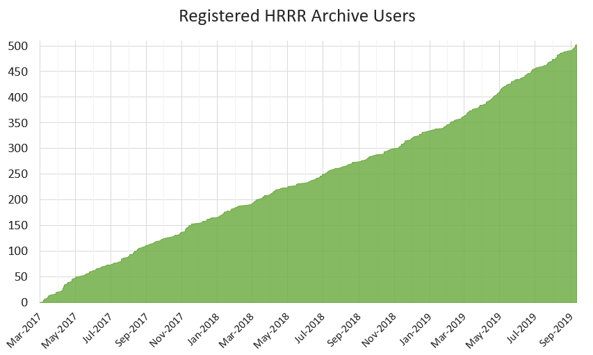
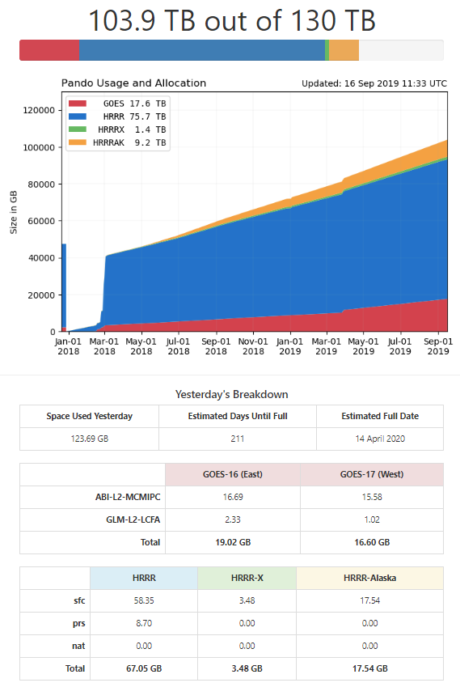

[//]: # (If not on github, you can view this markdown file with the Chrome extension "Markdown Preview Plus" or in VSCode hit the ctl+k then the v button)

**Author:** Brian Blaylock  
**Updated:** September 12, 2019  

 
 

# Using the Horel S3 Archive Buckets on Pando  

|Links to other documents|
|--|
|[How to use `rclone`](./docs/how_to_rclone.md)
|[How to use `s3cmd`](./docs/how_to_s3cmd.md)
|[Guide to potential Pando issues](./docs/potential_Pando_issues.md)
|[Accessing data from Pando](./docs/accessing_data_on_pando.md)
|[HRRR downloads](./HRRR_downloads/README.md)
|[GOES downloads](./GOES_downloads/README.md)
|[Graph of Pando allocation usage](http://home.chpc.utah.edu/~u0553130/Brian_Blaylock/Pando_archive/)
|[Other references](./docs/references.md)

---

## Introduction
Pando is an object-storage system at the University of Utah, similar to Amazon Web Services S3. [Pando](https://en.wikipedia.org/wiki/Pando_%28tree%29), latin for _I spread_, is named after the vast network of aspen trees in Utah, thought to be the largest and oldest living organism on earth; a fitting name for an archive system.

In January 2017, CHPC allocated the Horel Group 60 TB on the Pando S3 (Simple Storage
Service) archive space and an additional 70 TB in August 2018 for a **total of 130 TB**. This space is leased for a period of 5 years. The archive contains the High-Resolution Rapid Refresh (HRRR) model output, GOES-16/17 ABI and GLM data, and some buckets dedicated for testing and exploring the zarr data format.

>### Public access to data on Pando: Refer to the [Accessing Data](./docs/accessing_data_on_pando.md) document.

 

|      Important Dates            |   What happened?  | Notes  |
|---------------------------------|-------------------|--------|
| 2015-Apr-18 | Began downloading HRRR sfc and prs analyses | HRRRv1 Some days/hours may be missing|
| 2015-May-30 | Began downloading HRRR Bufr soundings for KSLC, KODG, and KPVU|
| 2016-Jul-27 | Began downloading HRRR sfc 15 hr forecasts| |
| 2016-Sep-01 | Taylor began downloading HRRR-Alaska prs analyses and sfc 36 hr forecasts| Runs occur every three hours, but becuase it's an experimental model, runs are not always availalbe.|
| 2016-Aug-23 | HRRRv2 implemented at NCEP starting with 12z run|
| 2016-Aug-24 | Began downloading HRRR sfc 18 hr forecasts| HRRRv2 increased forecasts from 15 to 18 hours.|
| 2016-Dec-01 | Began downloading experimental HRRR sfc analyses| HRRRv3: Runs aren't always available becuase this is an experimental model.|
| 2017-Oct-01 | Stopped downloading sub-hourly files| will start again when fire season begins (May 2018)|
| 2018-Jan | **Pando Failed and Rebuilt**| Start the archive again beginning January 1, 2018. Hope to recover past years with data from The Climate Company.|
|2019-Feb| Began archiving GOES-17| Archive ABI multichannel and GLM datasets|
|October 2019| Brian completed his degree at the University of Utah |

 > **Pando is experimental:** [Pando failed](http://home.chpc.utah.edu/~u0553130/Brian_Blaylock/Pando_archive/Pando_Failure.html) in January 2018, and the entire archive was lost. The archive was rebuilt, old HRRR files were restored, and we continued to archive HRRR and GOES data. We thank [The Climate Corporation](https://climate.com/) for supporting this service through the contribution of their NOAA HRRR archive prior to 2018. Because of them, we restored about 75% of what was lost.

 

## Mesohorse Pando Responsibilities
`horel-group7` (HG7) is the dedicated home of the Pando archive processing and backup. HG7 contains download scripts, documents, and is the space files are downloaded to before uploaded or "synced" with Pando.

The contents of `horel-group7/Pando/` is the backup for what is on Pando. Note that not everything on Pando is backed up on HG7. This is because HG7 only has 60 TB while our Pando allocation is 130 TB. Older data is removed from HG7 and is not backed up anywhere else. All content in this directory is owned by **mesohorse**. 

The contents of `horel-group7/Pando_Scripts/` includes documents for how Pando works and download scripts. The scripts perform the downloading and syncing of HRRR and GOES files between HG7 and Pando. These documents are owned by **Brian Blaylock**, however, download tasks are performed by **mesohorse**.

Downloads are set up as cron jobs on meso1 by mesohorse. 

    ## PANDO HRRR Download
    29 0,3,6,9,12,15,18,21 * * * /uufs/chpc.utah.edu/common/home/horel-group7/Pando_Scripts/HRRR_downloads/script_download_hrrr.csh > /uufs/chpc.utah.edu/common/home/horel-group7/Pando_Scripts/HRRR_downloads/hrrr.cronout

    ## PANDO GOES Download
    1,16,31,46 * * * * /uufs/chpc.utah.edu/common/home/horel-group7/Pando_Scripts/GOES_downloads/script_download_GOES.csh > /uufs/chpc.utah.edu/common/home/horel-group7/Pando_Scripts/GOES_downloads/goes.cronout

    ## PANDO Daily usage graphic and website
    30 5 * * * csh /uufs/chpc.utah.edu/common/home/horel-group7/Pando_Scripts/Daily_usage/Pando_daily_usage.csh > /uufs/chpc.utah.edu/common/home/horel-group7/Pando_Scripts/Daily_usage/usage.cronout

If you believe you should have mesohorse access, talk to John Horel. To become the mesohorse user, you need to do the following:

    sudo su - mesohorse

In my `.aliases` file, this is set up as an alias, `alias horse 'sudo su - mesohorse'` so that when I type `horse`, it makes me the mesohorse user.

 

> Any persons with the Pando access and secret keys can download and upload to Pando. These are necessary in the config files for `rclone` and `s3cmd`.
> Please refer to the [**rclone**](./docs/how_to_rclone.md) and [**s3cmd**](./docs/how_to_s3cmd.md) documents for more info.

 
-----

# Contents of this repository

### **`docs/`**
Additional documents of great worth and contains much wisdom.

### **`GOES_downloads/`**
Download scripts for the GOES-16 and GOES-17 data from the `noaa-goes16` and `noaa-goes17` bucket on Amazon S3. <big>🌟[**README**](./GOES_downloads/README.md)</big>

### **`HRRR_downloads/`**
Download scripts for the HRRR data. <big>🌟[**README**](./HRRR_downloads/README.md)</big>

### **`Daily_usage/`**
Keeps track of our Pando allocation. Contains a script to compute the daily disk usage on Pando and generates a graphical figure and a new html page with the data. The graphic and webpage is copied to Brian's *public_html* so it can be viewed on the web at http://home.chpc.utah.edu/~u0553130/Brian_Blaylock/Pando_archive/

- `Pando_daily_usage.csh` is the script executed by cron once per day.
- `daily_usage.py` is the python script. This requires python 3 and uses the intall in Brian's home directory.
- `Pando_Space.csv` is a file that contains the Pando disk usage by category type. It is appended each time you run the script `daily_usage.py`. This information is used to make the graphical figure.

### **`rclone-v1.39-linux-386/`**
Contains the version of rclone you should use so we don't get stuck when CHPC updates rclone versions. <big>🌟[**README**](./how_to_rclone.md)</big>

### **`s3cmd-2.0.1/`** 
Contains `s3cmd` which is used to change permissions of files on S3 from private to public, and vice versa. <big>🌟[**README**](./how_to_s3cmd.md)</big>

### **`misc/`**
Miscellaneous scripts that have been useful in the past.

 

# Pando Buckets and Directory Structure

For the purpose of this next section, **`horelS3:`** is the remote to access Pando as configured by `rclone` for the mesohorse user.

## **`horelS3:GOES16/`**
GOES-16 Level 2 data (multiband format) from the [Amazon AWS NOAA archive](https://aws.amazon.com/public-datasets/goes/).
- #### **`ABI-L2-MCMIPC/`** Advanced Baseline Imager, Level 2, multiband format Cloud Moisture products
  - _**`YYYYMMDD/`**_  
    -  Example File: `OR_ABI-L2-MCMIPC-M3_G16_s20172631727215_e20172631729588_c20172631730098.nc`  
    - File description on [Amazon](https://aws.amazon.com/public-datasets/goes/).
- **`GLM_L2_LCFA`** Geostationary Lightning Mapper, Level 2, Events/Groups/
Flashes
  - _**`YYYYMMDD/HH/`**_  
    - Example File: `OR_GLM-L2-LCFA_G16_s20190382239200_e20190382239400_c20190382239426.nc`

## **`horelS3:GOES17/`**
GOES-17 Level 2 data (multiband format) from the [Amazon AWS NOAA archive](https://aws.amazon.com/public-datasets/goes/).
- #### **`ABI-L2-MCMIPC/`** Advanced Baseline Imager, Level 2, multiband format Cloud Moisture products
  - _**`YYYYMMDD/HH/`**_  
    - Example File: `OR_ABI-L2-MCMIPC-M3_G16_s20172631727215_e20172631729588_c20172631730098.nc`  
    - File description on [Amazon](https://aws.amazon.com/public-datasets/goes/).
- **`GLM_L2_LCFA`** Geostationary Lightning Mapper, Level 2, Events/Groups/
Flashes
  - _**`YYYYMMDD/HH/`**_  
    - Example File: `OR_GLM-L2-LCFA_G17_s20190382239200_e20190382239400_c20190382239426.nc`

## **`horelS3:hrrr/`** Operational HRRR
  - **`sfc/`** Surface fields
    - _**`YYYYMMDD/`**_
      - Analysis and forecast hours (f00-f18) for all hours (00-23).
      - Note: F19-F36 forecasts are available, but we do not archive them.
      - File example: `hrrr.t00.wrfsfcf00.grib2`

  - **`prs/`** Pressure fields
    - **_`YYYYMMDD/`_**
      - Analysis hour (f00) only for all hours (00-23).
      - File example: `hrrr.t00.wrfprsf00.grib2`
 
## **`horelS3:hrrrX/`** Experimental HRRR
  - **`sfc/`** Surface fields
    - **_`YYYYMMDD/`_**
      - Analysis hour (f00) for all hours, if available.
      - File example: `hrrrX.t00.wrfsfcf00.grib2`

## **`horelS3:hrrrak/`** HRRR Alaska (Operational after 12 July 2018)
  - **`sfc/`** Surface fields
    - **_`YYYYMMDD/`_**
      - Analysis and 36 hour forecasts (f00-f36), if available. Runs initialize
      every three hours at 0z, 3z, 6z, 9z, 12z, 15z, 18z, 21z.
      - File example: `hrrrAK.t00.wrfsfcf00.grib2`
  - **`prs/`** Pressure fields
    - **_`YYYYMMDD/`_**
      - Analysis hours (f00) for run hours, if available
      - File example: `hrrrAK.t00.wrfsfcf00.grib2`

> **A visualization of HRRR file available on the S3 archive can be explored on the [HRRR download page](http://home.chpc.utah.edu/~u0553130/Brian_Blaylock/hrrr_FAQ.html).**

 

# 🖊 Archive Management
## HRRR Registration
The HRRR archive registration process is voluntary; users do not have to register to access data (it's just nice to know how many people are using the archive).

The [registration webpage](http://home.chpc.utah.edu/~u0553130/Brian_Blaylock/hrrr_download_register.html) uses [Formspree](https://formspree.io/). When someone submits the registration form, the contents of the forum are emailed to atmos-mesowest@lists.utah.edu. I kept an Excel sheet for the first 500 registered users. John Horel has a copy of that Excel sheet.

In the future, it would be nice to not rely on Formspree. I imagine the form would update a `.csv` file and auto generate a new graph to display on the webpage.

## Pando archive usage: How much space is left and when will the S3 archive fill up?
The [Pando Allocation Web Display (PAWD)](http://home.chpc.utah.edu/~u0553130/Brian_Blaylock/Pando_archive/) shows the Pando allocation and usage for each bucket. The script that creates this display is run once a day by Brian on meso4 and is located on [GitHub](https://github.com/blaylockbk/Web-Homepage/blob/master/Pando_archive/daily_usage.py).

The script that generates this page runs every morning on `meso4`. 

    .../u0553130/public_html/Brian_Blaylock/Pando_archive/

___

# Contact:
### **To contact the current archive managers, contact atmos-mesowest@lists.utah.edu**

To contact the original archive creator, contact Brian Blaylock  blaylockbk@gmail.com

